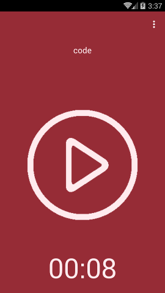
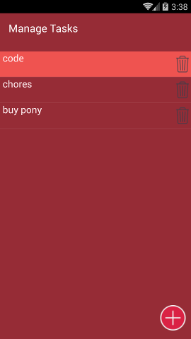
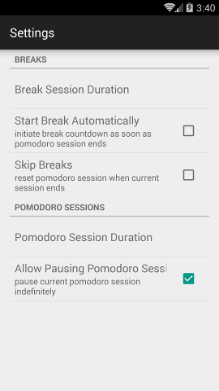
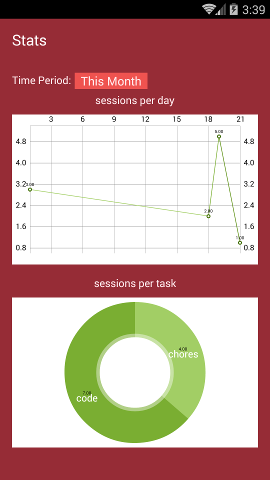

## Introduction
Marinara is a pomodoro app I work on in my free time whenever I want a break from 
my other projects. As such, progress is likely to happen in slow bursts. There are 
already tons of apps that fill this function in the Google Play store, so this is
really just a low-stress thing for me to work on. As a bonus, (eventually) I will
produce something fully-featured and free (as in free beer *and* freedom). 

## Status
Marinara is currently entering its **alpha** phase. A solid, first approximation of 
most requirements has been written, but unit testing is still missing.

## Features

Marinara allows offers an implementation of the [pomodoro technique](https://en.wikipedia.org/wiki/Pomodoro_Technique)
as a work flow to get things done. Currently, Marinara does not implement 'long breaks' after a set number of sessions.
Instead the current work flow follows each pomodoro session with a break of the same duration (default: 5 min) each time.
This may change, as I plan to re-vamp work flows so that optionally breaks can be ignored altogether and pomodoro sessions can
be started automatically once a user is "in the zone."

Marinara tags each pomodoro session with a task name. This is used for keeping statistics about the user's work habits. 
Currently statistics computed include number of sessions per day, and session per task for a given time period. In the future
other statistics may be included like: average sessions per given time period, sessions per time of the day over a multi-day 
time range, etc.

## Where are the docs?
I've documented most of the code in this project with javadoc style comments. Just run javadoc on
the command line to generate some documentation.

## Design Choices
##### Timing
Timing is handled as a bind service so it can run when the application does not have user focus.
The service uses android's CountDownTimer internally for the timer countdown and includes additional
logic to allow pausing the timer. 

##### Third Party Libraries
* [Sugar ORM](http://satyan.github.io/sugar/) is used for object relational mapping of tasks and sessions
* [MPAndroidChart](https://github.com/PhilJay/MPAndroidChart) is used to generate charts in the stats activity

## Future Changes/Features
* [ ] write instrumented unit tests to verify work flows function as expected
* [ ] implement bug reporting in app 
* [ ] add splash screen with motivational quotes 
* [ ] rewrite work flows, have an explicit Workflow class. To implement long breaks and (optionally) making sessions
        longer as user enters 'flow'
* [ ] switch from java.util.Date libraries to joda time libraries
